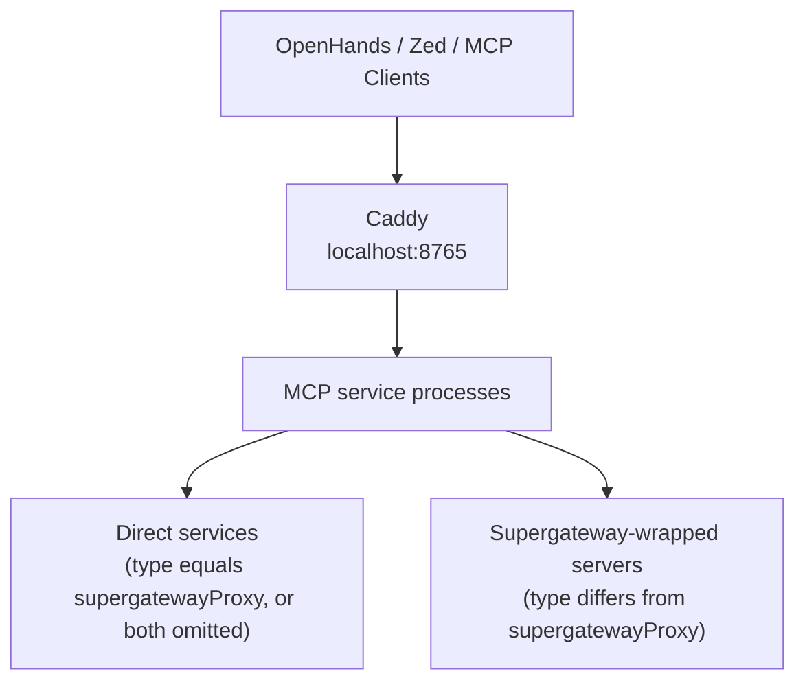

# Local MCP Infrastructure

This repository contains a lightweight local MCP infrastructure setup for macOS using:

- mise
- Caddy
- Supergateway
- launchd
- Nushell

The goal is to:

- keep MCP server definitions centralized
- support both direct stdio debugging and HTTP transports
- automatically generate local infrastructure files
- avoid Docker/Kubernetes complexity for local development

---

# Architecture



Each MCP server can still be run individually for debugging through `mise`.

---

# Files

## `mcp.toml`

This is the canonical MCP registry.

It defines:

- environment variables
- reusable MCP commands
- ports
- proxy paths
- optional transport type (`type`)
- optional desired exposed transport (`supergatewayProxy`)
- runtime dependencies

Example concepts contained in this file:

- `TIME_MCP_CMD`
- `FETCH_MCP_CMD`
- `[mcp.time]`
- `[mcp.fetch]`
- `type = "stdio" | "sse" | "streamableHttp"` (optional)
- `supergatewayProxy = "stdio" | "sse" | "streamableHttp"` (optional)

Supergateway wrapping rules:

- if `type != supergatewayProxy`, the service is wrapped by Supergateway
- if `type == supergatewayProxy`, the service runs directly
- if both `type` and `supergatewayProxy` are omitted, the service still runs directly
- when both are omitted and `port` + `path` are present, the service is treated as direct `streamableHttp` for launchd/Caddy generation

This file is intentionally human-editable and acts as the single source of truth.

---

## `generate-mcp.nu`

This Nushell script generates all derived infrastructure files from `mcp.toml`.

It also applies the transport decision logic above, including the "both omitted" direct mode.

Generated artifacts include:

- `config.mcp.toml` for `mise`
- `Caddyfile`
- `launchd` plist files
- OpenHands MCP configuration (optional future extension)

The script removes duplication between:
- runtime commands
- ports
- reverse proxy paths
- launchd services

---

# Generated Files

Generated files are written under:

```text
~/.config/mcp/generated/
```

Typical contents:

- `Caddyfile`
- `launchd/*.plist`

These generated files should generally not be manually edited.

---

# `mise` Integration

The generated `config.mcp.toml` provides:

- one task per MCP service (`mcp-<name>`)
- optional Supergateway wrapping depending on `type` and `supergatewayProxy`
- runtime/tool installation

Caddy is treated specially: it is **not** generated as an MCP task.

Example workflows:

- run time service via `mise run mcp-time`
- run inspector service via `mise run mcp-inspector`

This keeps execution predictable while still enabling transport conversion when needed.

---

# Reverse Proxy

Caddy exposes all MCP HTTP endpoints behind a single local port.

Example structure:

```text
localhost:8765/time/mcp
localhost:8765/fetch/mcp
localhost:8765/inspector
```

When a service is wrapped by Supergateway, endpoint suffixes follow Supergateway defaults:

- `supergatewayProxy = "streamableHttp"` → `<path>/mcp`
- `supergatewayProxy = "sse"` → `<path>/sse` (SSE subscribe endpoint) and `<path>/message` (JSON-RPC message endpoint)

Direct services (like Inspector) keep their declared `path`.

Internally these are routed to service ports that are either:
- direct services (when `type == supergatewayProxy`, or both fields are omitted)
- Supergateway processes (when transport conversion is required)

HTTPS is intentionally disabled to keep local development simple.

---

# launchd Integration

Each HTTP/SSE-exposed MCP service is managed through `launchd`.

Caddy also has a dedicated generated launchd entry (`dev.caddy`) that runs the generated `Caddyfile` directly via the resolved `caddy` binary path (`which caddy | get path`).

This provides:

- automatic startup
- process restart
- background execution
- native macOS service management

Generated plist files are installed into:

```text
~/Library/LaunchAgents/
```

Each generated service plist also writes logs to:

```text
/tmp/mcp-<name>.stdout.log
/tmp/mcp-<name>.stderr.log
```

This aligns with Supergateway behavior (stdio→HTTP logs on stdout, HTTP→stdio logs on stderr), while still keeping both streams available.

---

# Nushell Helper Function

The helper function is defined in:

```text
~/.config/mcp/mcp-install.nu
```

Add the following to:

```text
~/.config/nushell/config.nu
```

```text
# https://www.nushell.sh/book/configuration.html#macos-keeping-usr-bin-open-as-open
alias openn = open
alias open = ^open

# import mcp-install function
use ~/.config/mcp/generate-mcp.nu
use ~/.config/mcp/mcp-install.nu
```

This function automates:

- generating infrastructure files
- removing stale managed LaunchAgents (`dev.*.plist`) that are no longer generated
- copying plist files
- reloading launchd services

The function acts similarly to a lightweight local infrastructure deployment command.

Stale-cleanup safety rule: only `dev.*.plist` entries are treated as managed by this repository, so unrelated LaunchAgents are not deleted.

Typical usage:

```text
mcp-install
```

---

# Inspector

The setup also supports:

- MCP Inspector

The inspector can omit both `type` and `supergatewayProxy`, and still run directly without Supergateway wrapping.

With `port` + `path` present, it is treated as direct `streamableHttp`, so it remains accessible through Caddy and launchd.

Because Inspector serves frontend assets from absolute root URLs (for example `/assets/*` and `/mcp.svg`), the generated Caddy config also maps those root asset paths to the Inspector backend when Inspector is mounted under a subpath like `/inspector`.

---

# Why This Setup Exists

Most MCP examples today are:
- manually configured
- stdio-only
- duplicated across tools/editors

This setup attempts to centralize:
- transport management
- runtime management
- reverse proxying
- local service lifecycle

while remaining:
- lightweight
- Docker-free
- local-first
- easy to debug

---

# Future Extensions

Possible future additions:

- automatic OpenHands config generation
- authentication
- shared MCP gateway
- service discovery
- metrics/logging
- remote MCP exposure
- multi-user support
